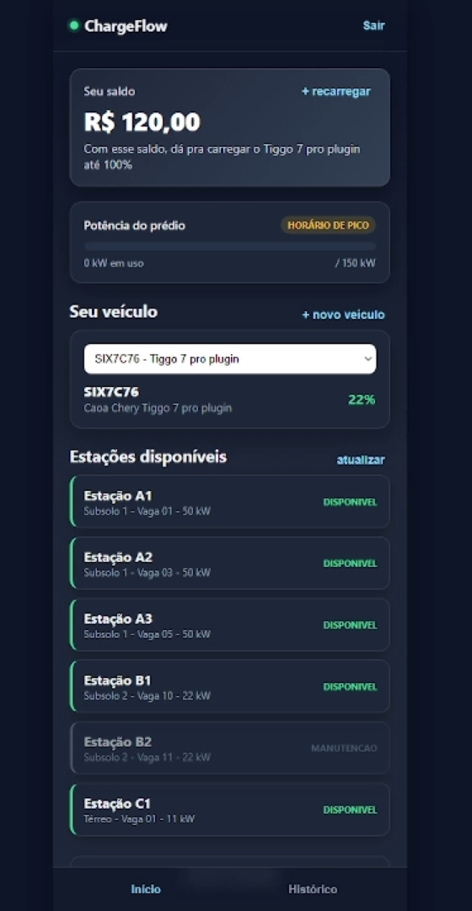
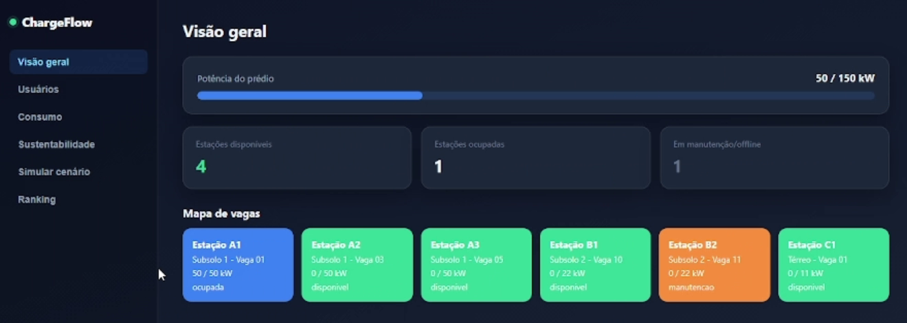
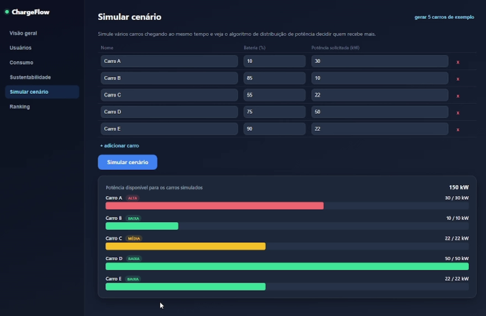
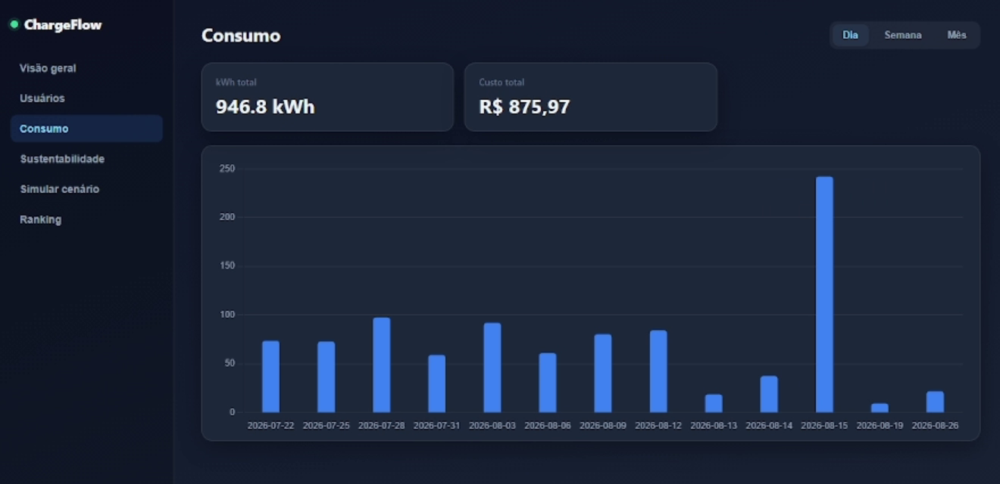
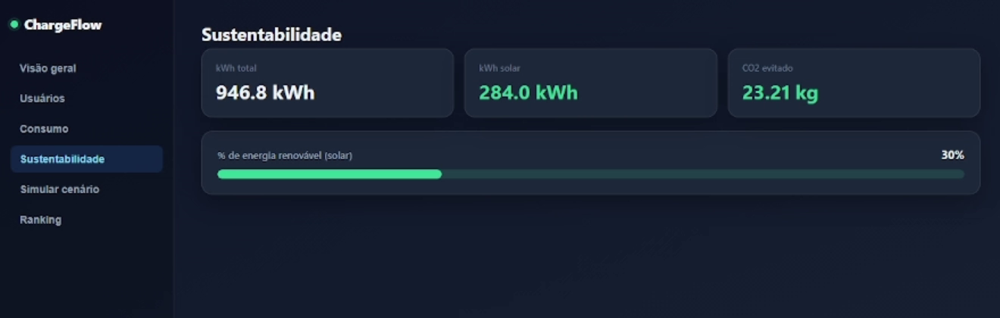
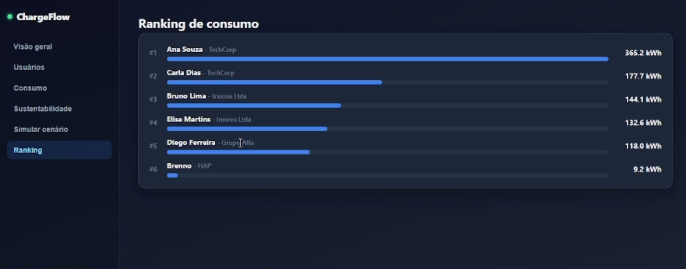

# Sprint 3 - Prototipagem Funcional e Integração

## ChargeFlow - Gestão Inteligente de Recarga de Veículos Elétricos

**Integrantes:**

- Enzo Stahal Freitas | RM: 569001
- Brenno Gomes | RM: 570525
- Eduardo Moreira | RM: 569923
- Matheus Bruno | RM: 572944

## Sobre o Projeto

O objetivo do projeto é gerenciar as recargas de veículos elétricos em um prédio com potência limitada. O ChargeFlow distribui a energia disponível entre as estações da garagem, dando prioridade a quem está com a bateria mais baixa, e mostra tudo em um app para o motorista e em um dashboard para o gestor.

O limite de potência do prédio é de 150 kW, mas as estações em operação somam 183 kW nominais (50 + 50 + 50 + 22 + 11). Se todos os carros conectarem ao mesmo tempo, o limite seria ultrapassado. Por isso o sistema não apenas libera as estações: ele decide quanto cada veículo recebe.

O protótipo foi demonstrado em uso real, com um motorista consultando o app dentro de uma garagem, e em simulações de cenários no dashboard. 

## Objetivo

Desenvolver um sistema capaz de:

- Receber os dados do veículo (placa, nível de bateria) e a potência solicitada.
- Calcular a potência disponível dentro do limite do prédio.
- Definir a prioridade de cada carro (alta, média ou baixa) com base na bateria.
- Distribuir a potência entre os veículos que estão carregando.
- Mostrar o estado das estações (disponível, ocupada ou em manutenção).
- Apresentar consumo, custo, energia solar, CO₂ evitado e ranking de usuários.

## Funcionalidades

### ENTRADA DE DADOS

O sistema utiliza:

- Veículo cadastrado (placa e nível de bateria em %)
- Potência solicitada por cada carro (kW)
- Estação escolhida pelo motorista
- Saldo do motorista

### PROCESSAMENTO

A potência disponível é calculada pela fórmula:

**Potência disponível = Limite do prédio (150 kW) - Potência em uso**

Em seguida, o motor de distribuição classifica cada carro pelo nível de bateria e reparte a potência disponível, começando por quem tem maior prioridade.

### PRIORIDADE DE RECARGA

- Prioridade **alta**: bateria muito baixa (ex.: 10 %)
- Prioridade **média**: bateria intermediária (ex.: 55 %)
- Prioridade **baixa**: bateria alta (ex.: 75 %, 85 % e 90 %)

### ESTADOS DAS ESTAÇÕES

- Estação **disponível** - verde
- Estação **ocupada** - azul
- Estação em **manutenção/offline** - laranja

### TOMADA DE DECISÃO

O sistema realiza ações automatizadas como:

- Atualizar o mapa de vagas conforme as estações são ocupadas ou liberadas
- Calcular a prioridade de cada carro conforme a bateria
- Distribuir a potência sem ultrapassar o limite do prédio
- Registrar o consumo (kWh) e o custo de cada recarga

### APRESENTAÇÃO DOS DADOS

O **app do motorista** mostra saldo, indicador de horário de pico, potência do prédio, veículo cadastrado com % de bateria e a lista de estações com o status de cada uma.

O **dashboard do gestor** tem as telas Visão geral, Usuários, Consumo, Sustentabilidade, Simular cenário e Ranking.

## Relação com Energias Renováveis

O projeto acompanha quanto da energia usada nas recargas vem da geração solar. O dashboard de Sustentabilidade mostra a energia total consumida, a parte que veio do sol, o percentual renovável e o CO₂ evitado. Com isso, o gestor enxerga o benefício ambiental da operação e pode incentivar recargas nos horários de maior geração solar, aliviando a rede no horário de pico.

## Relação com a Disciplina

- **Entrada:** placa, bateria, potência solicitada e saldo representam os dados que, em um sistema real, viriam do veículo e das estações.
- **Processamento:** o motor de distribuição calcula a potência disponível, define as prioridades e divide a energia entre os carros.
- **Armazenamento:** usuários, veículos, estações e sessões de recarga ficam registrados no banco de dados, permitindo os relatórios por dia, semana e mês.
- **Saída:** app do motorista e dashboard do gestor apresentam o resultado em tempo real.
- **Integração:** app, dashboard, API e motor de potência trabalham em conjunto, como mostra o esquema abaixo.

## Esquema de Integração

```
 App do motorista            Dashboard do gestor
 (web mobile)                (web desktop)
        |                            |
        +------------+---------------+
                     |
               API / Backend  <------>  Banco de dados
                     |                  (usuários, veículos,
        +------------+----------+        estações, sessões)
        |            |          |
   Motor de      Custo e     Sustentabilidade
   distribuição  saldo       (kWh solar, CO₂ evitado)
   de potência
   (limite 150 kW)
        |
   Estações de recarga
   A1, A2, A3 (50 kW) | B1, B2 (22 kW) | C1 (11 kW)
```

Fluxo de uma sessão: o motorista abre o app, escolhe o veículo e uma estação livre; o sistema confere a potência disponível no prédio, calcula a prioridade pela bateria, distribui a potência e, durante a recarga, registra kWh e custo, atualizando o dashboard.

## Estações do Protótipo

| Estação | Local | Potência | Estado na demonstração |
|---|---|---|---|
| A1 | Subsolo 1 - Vaga 01 | 50 kW | Ocupada |
| A2 | Subsolo 1 - Vaga 03 | 50 kW | Disponível |
| A3 | Subsolo 1 - Vaga 05 | 50 kW | Disponível |
| B1 | Subsolo 2 - Vaga 10 | 22 kW | Disponível |
| B2 | Subsolo 2 - Vaga 11 | 22 kW | Manutenção |
| C1 | Térreo - Vaga 01 | 11 kW | Disponível |

## Telas do Protótipo

**App do motorista**



**Dashboard - Visão geral**



**Dashboard - Simular cenário**



**Dashboard - Consumo**



**Dashboard - Sustentabilidade**



**Dashboard - Ranking de consumo**



## Exemplo de Uso

**Situação 1 - Cenário simulado com 5 carros chegando juntos (150 kW disponíveis)**

- Carro A: bateria 10 %, solicita 30 kW - prioridade ALTA - recebe 30 kW
- Carro B: bateria 85 %, solicita 10 kW - prioridade BAIXA - recebe 10 kW
- Carro C: bateria 55 %, solicita 22 kW - prioridade MÉDIA - recebe 22 kW
- Carro D: bateria 75 %, solicita 50 kW - prioridade BAIXA - recebe 50 kW
- Carro E: bateria 90 %, solicita 22 kW - prioridade BAIXA - recebe 22 kW
- Total solicitado: 134 kW, dentro do limite de 150 kW (folga de 16 kW)

**Situação 2 - Visão geral do prédio**

- Potência em uso: 50 / 150 kW
- Estações disponíveis: 4
- Estações ocupadas: 1 (A1, 50 / 50 kW)
- Estações em manutenção/offline: 1 (B2)

**Situação 3 - Consumo e sustentabilidade acumulados**

- Energia total: 946,8 kWh
- Custo total: R$ 875,97
- Energia solar: 284,0 kWh (30 % de energia renovável)
- CO₂ evitado: 23,21 kg

Ranking de consumo (soma 946,8 kWh, igual ao total do painel):

| # | Usuário | Empresa | Energia |
|---|---|---|---|
| 1 | Ana Souza | TechCorp | 365,2 kWh |
| 2 | Carla Dias | TechCorp | 177,7 kWh |
| 3 | Bruno Lima | Innova Ltda | 144,1 kWh |
| 4 | Elisa Martins | Innova Ltda | 132,6 kWh |
| 5 | Diego Ferreira | Grupo Alfa | 118,0 kWh |
| 6 | Brenno | FIAP | 9,2 kWh |

## Vídeo de Demonstração

[PREENCHER: link do vídeo no YouTube (não listado)]
